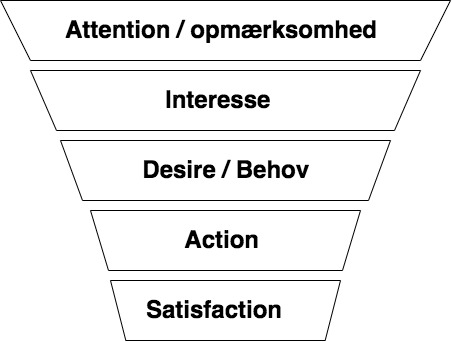
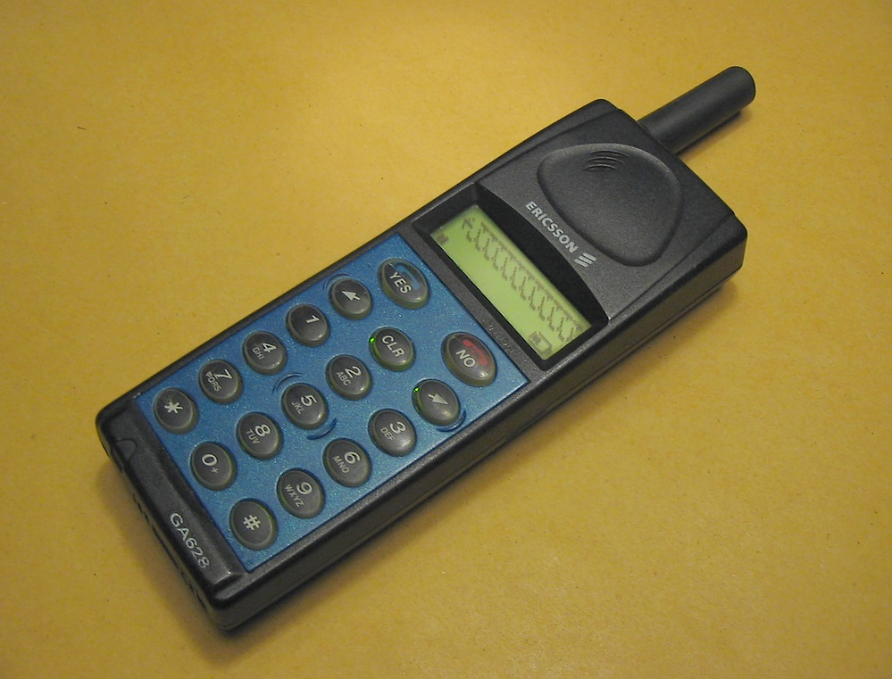

# Interaktionsdesign
Svensk wikipedia definere interaktionsdesign som "Interaktionsdesign handlar om att forma produkter, tjänster och miljöer med särskilt fokus på deras brukskvalitéer".

Vi holder os til design af interaktionen mellem bruger og det digitale medie vi arbejder med.

### Øvelse
* Oversæt den svenske tekst til dansk, brukskvalitéer bliver ofte oversat til usability eller brugervenlighed.
* Lav jeres egen definition hvor fokus er på digital interaktion.

Der er mange måder at lave godt design og ingen strikse love. For at hjælpe designprocessen er der lavet en række heurestikker. NB! heurestik er et flot ord men betyder bare tommelfingerregel, så ved I det.

Steve Krug skrev bogen **Don't make me think** om human-computer interaktion.

### Øvelse
* Hvorfor søren er det en god designstrategi at brugeren ikke skal tænke sig om?

En af måderne man vi kan undgå at tænke er, hvis de side vi kommer ind på ligner hinanden.

### Øvelse
* Undersøg nogle hjemmesider fra etablerede virksomheder eller organisationen.
* Er der et gennemgående træk i hvordan de er organiseret?
* Kom med tommelfingerregler (heurestik) for hvor man placere, *søgefunktionen, menuen, kontaktinformation*.

Don Norman kom med sin ** Design of everyday things ** med 6 designprincipper;
* Visibility, synlighed, det man kan se bruger man.
* Feedback, feedback ved handlinger.
* Constraints, begrænsninger er godt, hvis det letter brugen.
* Mapping, intet godt dansk ord, men et simpelt eksempel er at venstre piletast skal føre mod venstre, å tasten skal give et å osv.
* Consistency, konsistens, at knapper betyder det samme gennem hjemmesiden og at designet ikke skifter umotiveret.
* Affordance, tydelighed i anvendelse.

Principperne er beskrevet af Sachin Rekhi, [don-normans-principles-of-interaction-design](https://medium.com/@sachinrekhi/don-normans-principles-of-interaction-design-51025a2c0f33).

### Øvelse
Gruppeøvelse hvor hver gruppe skal fremlægge et af Normans principper. Hver gruppe skal bruge Sachin Rekhins hjemmeside til at lave en præsentation af ét af principperne. Præsentationen samles her, [Normans designprincipper præsentation](https://docs.google.com/presentation/d/1StkO8ya42OsNxh29v4Xsq89OPHtUr1SZgylMc9vltvk/edit?usp=sharing).

## AIDA modellen

kilde: iftek.dk/aida-s

AIDA er en model, der handler om at analysere reklamer. Reklamer kan her forstås ret overordnet, så det kan sådan ser være enhver tekst, der har et budskab, som læseren eller forbrugeren skal reagere på. Modellen kan derfor også anvendes til at analysere test, spil, websites m.m. Man kan sige, det handler om at skabe visuelle udtryk, altså om brugergrænseflader kan sælge!

* Atention: Er der noget, der fanger brugerens opmærksomhed? (fx et rigtigt flot billede af en ung, der smiler med perfekte, hvide tænder)
* Interest: Er der noget det skaber brugerens interesse, fx en lokke-tekst? (fx sætningen "Hvide tænder *er* bare smukkere!")
* Desire: Er der noget, der omdanner denne interesse til et konkret behov? (fx sætningen: "Du kan også få smukke, hvide tænder!)
* Action: Er der noget der leder brugeren hen til en konkret handling, der kan tilfredsstille dette behov, fx at købe et produkt, melde sig ind, stemme på et parti eller lignende? (Fx tryk her for at lægge en pakke MACSO-tandpaste i varekurven!").

Alle punkter behøver ikke være til stede i en god reklame, men det er en overordnet model for gode reklamer.

* Satisfaction
Nogle har forsøgt at tilføje et S til modellen for Satisfaction/tilfredshed, altså hvordan brugerne kommer til at vende tilbage, anbefaler produktet til andre. Det kunne fx være "Tryk her for at like MACSO" eller knapper til at anbefale tandpastaen på sociale medier eller muligheder for at anbefale på TRUSTPILOT eller lign.

## Målgruppe og Persona
For at kunne bruge AIDA modellen skal man afgrænse målgruppen. Det er vigtigt at produktet ikke bare er til alle, for hvordan vinkler man sit produkt så det netop appellere til alle? Generelt vil det være lettere at begrunde sine valg hvis man fokusere på en relativt lille målgruppe. En måde at gøre målgruppen konkret på er at arbejde med personaer. Det er fiktive personer som kunne tilhøre målgruppen.

Ved udviklingen af borger.dk blev der udarbejdet 6 personaer
* Camilla og Jesper - "De selvkørende"
* Claus - "De velvillige"
* Johannes - "De unge borgere"
* Amina - "De tøvende"
* Verner - "De IT-fremmede"
* Florian - "I Danmark for en kort periode"
kilde: [Personas for borger.dk](https://www.yumpu.com/da/document/read/18275658/personas-for-borgerdk)

Det er også samlet i brochuren [Personas brogerDK](Personas_borgerDK.pdf)

## Øvelse
* Find Amina i brochuren.
* Læs det første afsnit, og diskuter hvorfor de laver en så detaljeret personbeskrivelse.

### Øvelse
Vi vil nu gerne have Amira til at bevæge sig mere med et spil vi har lavet.
* Brug Amina som case og overvej hvilke valg man skal træffe i forhold til AIDA modellen for at det lykkes.

# Kommunikation
Afsende -> kommunikaitonsmiddlet -> modtager
Problemer kan påstå fordi
* Fortolkning fra afsender.
* Fortolkning fra modtager.
* Støj i kommunikationen.
* Mangelfuld kommunikation.

### Øvelse
* Find hverdageeksempler hvor der kan være problemer med fortolkningen hos afsender og modetager.

En løsning på fortolkningsproblematikken er klar og fyldestgørende information. Hvilket bringer os videre til

Real life example:
Mine børn er hos min mor og jeg er i sommerhus og vil gerne tage på Nygaarden med dem og plukke blåbær.
Kommunikationen er:

### Øvelse
* Tror I at vi nåede at plukke blåbær sammen?

Svaret er nej, vi ventede i sommerhuset mens de tog til Nygaarden, vi fik dog blåbær!
* Overvej hver af de fire punkter i forhold til kommunikationen.
* Kom med en ting jeg kunne have gjort.
* Kom med en ting min mor kunne have gjort.

### Besværligt at kommunikere.
En del af problematikken er, at det er besværligt at kommunikere. Det tager både tid at sende og modtage information og kræver energi og engagement i selve kommunikationen.

Den første SMS blev sendt den 3. december, 1992. Min første blev sendt på denne EricssonGA628.

[https://en.wikipedia.org/wiki/File:Ericsson_GA_628.jpg](https://en.wikipedia.org/wiki/File:Ericsson_GA_628.jpg)

Det var ret besværligt at skrive og læse beskeder, og mit bedste bud var at folk ret hurtigt vil blive træt af det.

### Øvelse
* Kom med begrundelser for at den jo alligevel blev så populær.

## Feedback
Det at man slipper for small talk og høflighedsfraser som godt kan tage lang tid er nok en af grundene til at SMS er blevet så populært. Det man mangler er feedback, har modtageren fået beskeden, har hun forstået det jer vil osv.

Denne del er også vigtig når det er kommunikation mellem bruger og et computersystem.

En tilmeldingsformulat til et kursus jeg holder ender ofte sådan

Det betyder ikke at jeg ikke modtager tilmeldingen, men afsenderen er usikker på om han er tilmeldt og jeg bliver nød til at skrive mails frem og tilbage.

### Øvelse
* Find et eksempel fra jeres computer hvor den giver besked om at den arbejder og at man bare skal vente i god ro og orden.
* Overvej hvordan I vil vise at jeres program kører, så brugeren ikke bliver usikker.

## Støj i kommunikationen
[innovation.sites.ku.dk/metode/brainwalking/](https://innovation.sites.ku.dk/metode/brainwalking/)

