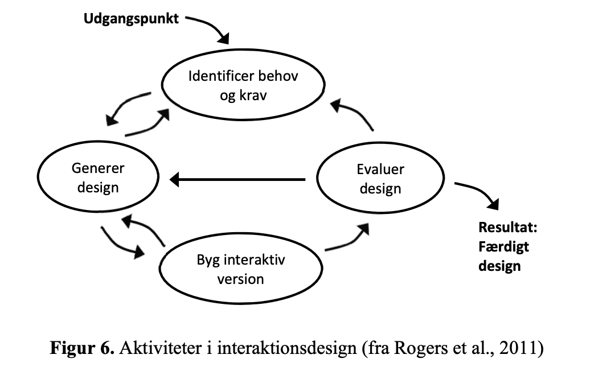

### Indholdsfortegnelse
* [Innovation](#innovation)
* [Iterativ arbejdsprocess](#iterativ-arbejdsprocess)
* [Rapid prototyping](#rapid-prototyping)
* [Idegenerering](#idegenerering)
* [Målgruppe og persone](#målgruppe-og-persona)

# Innovation
Ifølge wikipedia er innovation
*Innovation i private virksomheder defineres af Eurostat og OECD i Oslo manualen som introduktionen af et nyt eller væsentligt forbedret produkt (vare eller tjenesteydelser), proces, organisationsform eller markedsføringsmetode. Der skelnes således mellem fire innovationstyper: Produktinnovation, procesinnovation, organisatorisk innovation samt markedsføringsinnovation. Innovationen skal være ny (eller væsentligt forbedret) for virksomheden selv, men kan være udviklet af andre eller introduceret før af andre.*
kilde: [https://da.wikipedia.org/wiki/Innovation](https://da.wikipedia.org/wiki/Innovation)

I gymnasiet bruger vi ofte at det skal være
* Nyt
* Nyttigt
* Nyttiggjort
som beskrevet af KL i  Handlingsplan for Center for Offentlig Innovation.

### Øvelse
* Beskriv hvad der er forskellen på de tre begreber, *nyt,nyttigt,nyttiggjort*.
* Overvej hvordan det afspejles i private virksomheders ide om innovation.

Vi skal arbejde med arbejdsprocesser som kan lede frem til innovative produkter. Det er vigtigt at dokumenterer den innovative process når I arbejder med den.

## Iterativ arbejdsprocess
Ved udvikling af IT-systemer bruger vi en iterativ arbejdsform. Roger har beskrevet hele forløbet i tilblivelsen af et IT-system. Som I kan se er det hele forbundet og det er meningen at man bevæger sig mellem alle boblerne og kommer tilbage til dem flere gange i processen. Dette skal ses i kontrast til en lineær arbejdsmodel, hvor der arbejdes fra krav og specfikationer gennem design og udarbejdelse til resultat.

### Øvelse
* Beskriv de forskellige delelementer i interaktionsdesignet ud fra modellen.
* Beskriv fordelene ved at arbejde iterativt når man arbejder med produktudvikling.
* Beskriv hvorfor modellen ikke altid bliver brugt.

I jeres arbejde vil I ofte arbejde med delelementer af den iterative proces.

## Rapid prototyping
Noget af det vigtigste er at I prøver at hold det simpelt. Det er vigtigere og sjovere at have noget simpelt der virker end noget kompliceret som ikke virker. En af måderne er **rapid prototyping** hvilket Tom Chi fra Google innovation lab beskriver,

[Tom Chi ted talk](https://www.youtube.com/watch?v=d5_h1VuwD6g&feature=youtu.be).

### Øvelse
* Beskriv hvordan den simpleste fysiske del af jeres projekt kan se ud.
* Beskriv hvordan den simpleste programmeringsmæssige kan se ud.
* Sæt Tom Chis arbejde ind i modellen for den iterative arbejdsprocess.

### PROTOTYPE, definition fra [Informatik-gym.dk](Informatik-gym.dk)
"En prototype er en tidlig udgave af et produkt. I Informatik bygges papir prototyper som anvendes i brugertest med det formål at blive klogere på produktet. Fordelen ved prototyper er, at det er nemt og billigt at ændre dem (sammenlignet med ændringer af færdige produkter)."

### Øvelse
I skal foretage en brugertest som beskrevet her, [innovation.sites.ku.dk/metode/brugertest/](https://innovation.sites.ku.dk/metode/brugertest/).
* Læs vejledningen.
* Foretag en brugertest.
* Diskuter og skriv ned hvad I har fået ud af den.

## Idegenerering
Vi skal i gang med idegenerering hvor vi skal lave nogen øvelser. Øvelserne bruges mange steder og bl.a. på Københavns Universitet. De har samlet øvelserne i denne side,

[innovation.sites.ku.dk/metoder](https://innovation.sites.ku.dk/metoder/)

Vi skal bruge øvelsen **Brainwalkig**. Det er en afart af den normale brainstorm, men her bliver I tvunget til at forholde jer til de andres ideer og selv bidrage til deres udvikling.

### Øvelse - brainwalking
Øverst på papiret skal I skrive
* Hvad er jeres målgruppe.
* Hvilket problem prøver I at løse.

Vi starter med 5 minutters klassisk brainstorm, hvorefter vi tager hul på vandringen.

* Find reglerne for brainwalking på websiden.

## Målgruppe og Persona
For at kunne udvikle et innovativt produkt skal man afgrænse målgruppen. Det er vigtigt at produktet ikke bare er til alle, for hvordan vinkler man sit produkt så det netop appellere til alle? Generelt vil det være lettere at begrunde sine valg hvis man fokusere på en relativt lille målgruppe. En måde at gøre målgruppen konkret på er at arbejde med personaer. Det er fiktive personer som kunne tilhøre målgruppen.

Ved udviklingen af borger.dk blev der udarbejdet 6 personaer
* Camilla og Jesper - "De selvkørende"
* Claus - "De velvillige"
* Johannes - "De unge borgere"
* Amina - "De tøvende"
* Verner - "De IT-fremmede"
* Florian - "I Danmark for en kort periode"
kilde: [Personas for borger.dk](https://www.yumpu.com/da/document/read/18275658/personas-for-borgerdk)

Det er også samlet i brochuren [Personas brogerDK](Personas_borgerDK.pdf)

## Øvelse
* Find Amina i brochuren.
* Læs det første afsnit, og diskuter hvorfor de laver en så detaljeret personbeskrivelse.

### Øvelse
Vi vil nu gerne have Amira til at bevæge sig mere med et spil vi har lavet.
* Brug Amina som case og overvej hvilke valg man skal træffe i forhold til AIDA modellen for at det lykkes.

