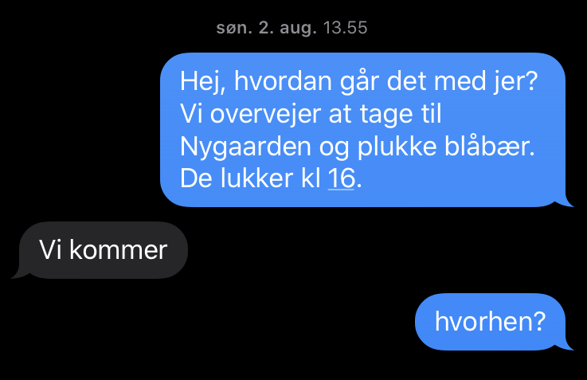
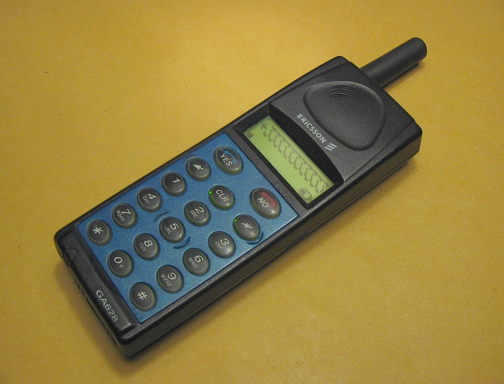

# Kommunikation
Afsende -> kommunikaitonsmiddlet -> modtager
Problemer kan påstå fordi
* Fortolkning fra afsender.
* Fortolkning fra modtager.
* Støj i kommunikationen.
* Mangelfuld kommunikation.

### Øvelse
* Find hverdageeksempler hvor der kan være problemer med fortolkningen hos afsender og modetager.

En løsning på fortolkningsproblematikken er klar og fyldestgørende information. Hvilket bringer os videre til

Real life example:
Mine børn er hos min mor og jeg er i sommerhus og vil gerne tage på Nygaarden med dem og plukke blåbær.
Kommunikationen er:

### Øvelse
* Tror I at vi nåede at plukke blåbær sammen?

Svaret er nej, vi ventede i sommerhuset mens de tog til Nygaarden, vi fik dog blåbær!
* Overvej hver af de fire punkter i forhold til kommunikationen.
*  Kom med en ting jeg kunne have gjort.
* Kom med en ting min mor kunne have gjort.

### Besværligt at kommunikere.
En del af problematikken er, at det er besværligt at kommunikere. Det tager både tid at sende og modtage information og kræver energi og engagement i selve kommunikationen.

Den første SMS blev sendt den 3. december, 1992. Min første blev sendt på denne EricssonGA628.

[https://en.wikipedia.org/wiki/File:Ericsson_GA_628.jpg](https://en.wikipedia.org/wiki/File:Ericsson_GA_628.jpg)

Det var ret besværligt at skrive og læse beskeder, og mit bedste bud var at folk ret hurtigt vil blive træt af det.

### Øvelse
* Kom med begrundelser for at den jo alligevel blev så populær.

## Feedback
Det at man slipper for small talk og høflighedsfraser som godt kan tage lang tid er nok en af grundene til at SMS er blevet så populært. Det man mangler er feedback, har modtageren fået beskeden, har hun forstået det jer vil osv.

Denne del er også vigtig når det er kommunikation mellem bruger og et computersystem.

En tilmeldingsformulat til et kursus jeg holder ender ofte sådan

Det betyder ikke at jeg ikke modtager tilmeldingen, men afsenderen er usikker på om han er tilmeldt og jeg bliver nød til at skrive mails frem og tilbage.

### Øvelse
* Find et eksempel fra jeres computer hvor den giver besked om at den arbejder og at man bare skal vente i god ro og orden.
* Overvej hvordan I vil vise at jeres program kører, så brugeren ikke bliver usikker.

## Støj i kommunikationen

[innovation.sites.ku.dk/metode/brainwalking/](https://innovation.sites.ku.dk/metode/brainwalking/)
